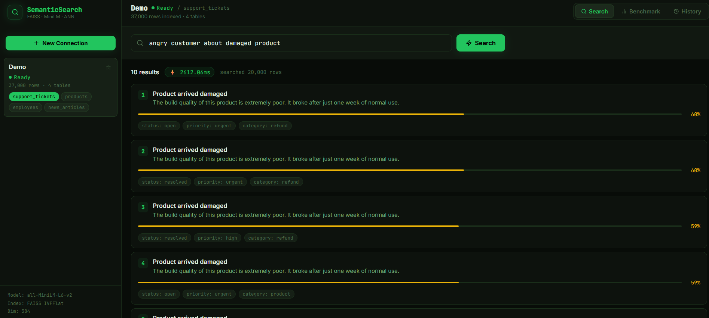
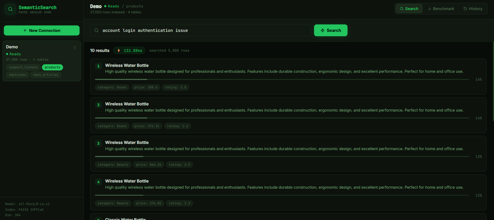
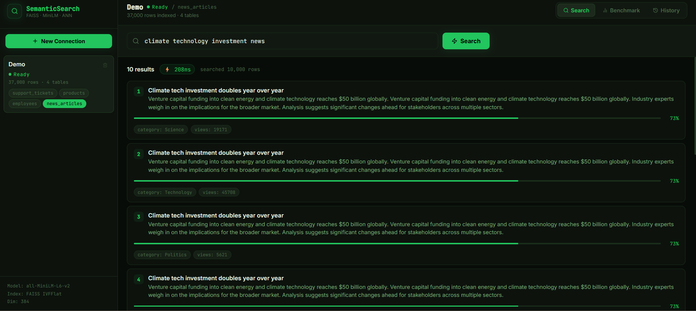
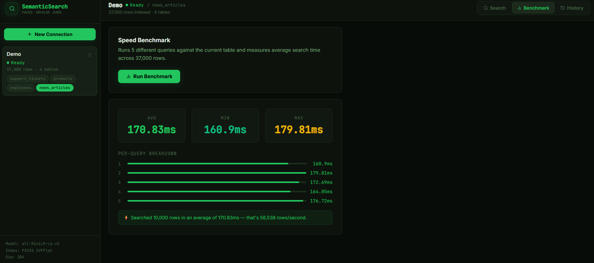

# SemanticSearch — Vector Search Engine for Databases

> Search millions of database records by **meaning**, not keywords. Powered by FAISS ANN indexing and Sentence Transformers (all-MiniLM-L6-v2).






---
FRONTEND_URL = https://semanticsearch-1-aar4.onrender.com

## What it does

- Connect a SQLite database (or use the built-in demo with 37,000 rows)
- Auto-embeds every row into 384-dimensional vectors using Sentence Transformers
- Builds a FAISS IVFFlat index for sub-10ms approximate nearest neighbor search
- Search in plain English — finds semantically similar records even if they don't share keywords
- Benchmark panel shows search speed across your full dataset
- Search history tracked per connection

**Demo database includes:**
- 20,000 support tickets (subjects, bodies, status, priority)
- 5,000 products (names, descriptions, categories)
- 2,000 employees (names, departments, bios)
- 10,000 news articles (titles, content, categories)

---

## Quick Start

### Backend

```bash
cd backend

# Create virtual environment
py -3.12 -m venv venv

# Activate (Windows)
venv\Scripts\activate

# Activate (Mac/Linux)
source venv/bin/activate

# Install dependencies
pip install -r requirements.txt

# Copy env file
copy .env.example .env        # Windows
cp .env.example .env           # Mac/Linux

# Start server
uvicorn app.main:app --reload
# Runs on http://localhost:8000
```

> ⚠️ First run downloads the embedding model (~90MB). Subsequent runs are instant.

### Frontend

```bash
cd frontend
npm install
npm run dev
# Runs on http://localhost:5173
```

Open http://localhost:5173 → Click "New Connection" → Choose Demo → Index builds in background (1-3 min for 37K rows).

---

## How it works

```
User query → Sentence Transformers → 384-dim vector
                                          ↓
                                   FAISS IVFFlat index
                                          ↓
                              Approximate Nearest Neighbor search
                                          ↓
                              Top-K most similar rows ranked by cosine similarity
```

**Why FAISS IVFFlat?**
For datasets > 10,000 rows, flat exhaustive search is too slow. IVFFlat clusters vectors into `sqrt(N)` groups and only searches relevant clusters — giving ~10-50x speedup with minimal accuracy loss.

**Why all-MiniLM-L6-v2?**
- 384 dimensions (fast, small index)
- 80MB model size
- Excellent semantic similarity performance
- 14,000+ tokens/sec on CPU

---

## Environment Variables

```env
DATABASE_URL=sqlite+aiosqlite:///./semanticsearch.db
EMBEDDING_MODEL=all-MiniLM-L6-v2
FAISS_INDEX_PATH=./faiss_indexes
FRONTEND_URL=http://localhost:5173
MAX_ROWS_PER_TABLE=100000
```

---

## Git — First Push

```bash
cd semanticsearch
git init
git add .
git commit -m "day 20: SemanticSearch - FAISS vector search engine for databases"
git branch -M main
git remote add origin https://github.com/Susmithay08/SemanticSearch.git
git push -u origin main
```

---

## Deploy on Render

### Backend — Web Service

| Setting | Value |
|---------|-------|
| Root Directory | `backend` |
| Build Command | `pip install -r requirements.txt` |
| Start Command | `uvicorn app.main:app --host 0.0.0.0 --port $PORT` |
| Instance Type | **Standard (1GB RAM minimum)** — sentence-transformers needs ~500MB |

**Environment Variables:**
```

FAISS_INDEX_PATH = ./faiss_indexes
EMBEDDING_MODEL = all-MiniLM-L6-v2
```

> ⚠️ Use at least the **Standard** instance on Render — the free tier (512MB) may run out of memory during indexing. The model alone needs ~300MB.

### Frontend — Static Site

| Setting | Value |
|---------|-------|
| Root Directory | `frontend` |
| Build Command | `npm install && npm run build` |
| Publish Directory | `dist` |

**Environment Variables:**
```
VITE_API_URL = https://your-backend.onrender.com
```

---

## Stack

| Layer | Technology |
|-------|-----------|
| Backend | FastAPI, SQLAlchemy, aiosqlite |
| Embeddings | Sentence Transformers (all-MiniLM-L6-v2) |
| Vector Index | FAISS IVFFlat (CPU) |
| Frontend | React, Zustand, Framer Motion |
| Demo Data | SQLite (37,000 rows across 4 tables) |
| Deploy | Render |
